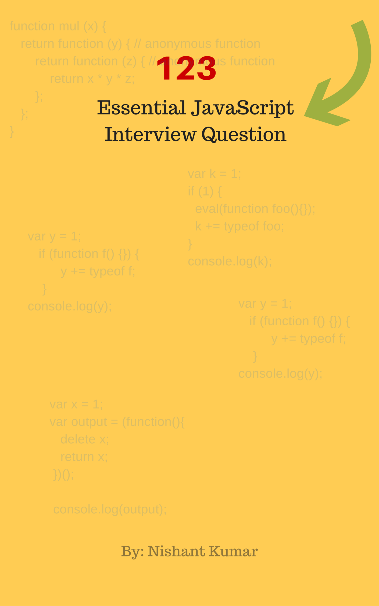

# 123-JavaScript-Interview-Questions

This book's goal is to help javascript frontend developers prepare for technical job interviews through a collection of carefully compiled questions.

## Want to buy a book in paper form? Want some badass flashcards?

 - This Book will be soon completed and then it will be available to buy in paper form. If you want me to send you an early copy of this book, please add your name and email address in this [Google Form](https://goo.gl/forms/c8ubV1tWBBdz6fJP2).
 - If you don't want to wait, you can buy [Yuri's JavaScript Flashcards](http://flashcardsjs.com), a set of frontend interview questions sorted by popularity among interviewers printed on beautiful poker-size flashcards.

## Question 1. What's the difference between `undefined` and `not defined` in JavaScript

<details><summary><b>Answer</b></summary>

In JavaScript if you try to use a variable that doesn't exist and has not been declared, then JavaScript will throw an error `var name is not defined` and the script will stop executing thereafter. But If you use `typeof undeclared_variable` then it will return `undefined`.

Before starting further discussion let's understand the difference between declaration and definition.

`var x` is a declaration because we are not defining what value it holds yet, but we are declaring its existence and the need for memory allocation.

```javascript
var x; // declaring x
console.log(x); // output: undefined
```

`var x = 1` is both declaration and definition, here declaration and assignment of value happen inline for variable x—what we are doing is called "initialisation". In JavaScript both variable declarations and function declarations go to the top of the scope in which they are declared, then assignment happens—this series of events is called "hoisting".

A variable can be declared but not defined. When we try to access it, It will result `undefined`.

```javascript
var x; // Declaration
typeof x === 'undefined'; // Will return true
```

A variable can be neither declared nor defined. When we try to reference such variable then the result will be `not defined`.

```javascript
console.log(y);  // Output: ReferenceError: y is not defined
```

### Ref Link:
[http://stackoverflow.com/questions/20822022/javascript-variable-definition-declaration](http://stackoverflow.com/questions/20822022/javascript-variable-definition-declaration)

</details>

## Question 2. For which value of `x` the results of the following statements are not the same?


```javascript
if( x <= 100 ) {...}
if( !(x > 100) ) {...}
```
<details><summary><b>Answer</b></summary>

`NaN <= 100` is `false` and `NaN > 100` is also `false`, so if the
value of `x` is `NaN`, the statements are not the same.

The same holds true for any value of x that being converted to type Number, returns `NaN`, e.g.: `undefined`, `[1,2,5]`, `{a:22}` , etc.

This is why you need to pay attention when you deal with numeric variables. `NaN` can’t be equal, less than or more than any other numeric value, so the only reliable way to check if the value is `NaN`, is to use the `isNaN()` function.

</details>

## Question 3. What is the drawback of declaring methods directly in JavaScript objects?

<details><summary><b>Answer</b></summary>

One of the drawbacks of declaring methods directly in JavaScript objects is that they are very memory inefficient.  When you do that, a new copy of the method is created for each instance of an object. Here's an example:

```javascript
var Employee = function (name, company, salary) {
  this.name = name || "";       
  this.company = company || "";
  this.salary = salary || 5000;

  // We can create a method like this:
  this.formatSalary = function () {
      return "$ " + this.salary;
  };
};

// Alternatively we can add the method to Employee's prototype:
Employee.prototype.formatSalary2 = function() {
    return "$ " + this.salary;
}

//creating objects
var emp1 = new Employee('Yuri Garagin', 'Company 1', 1000000);
var emp2 = new Employee('Dinesh Gupta', 'Company 2', 1039999);
var emp3 = new Employee('Erich Fromm', 'Company 3', 1299483);
```

In this case each instance variable `emp1`, `emp2`, `emp3` has its own copy of the`formatSalary` method. However the `formatSalary2` will only be added once to `Employee.prototype`.

</details>

## Question 4. What is “closure” in javascript? Can you provide an example?

<details><summary><b>Answer</b></summary>

A closure is a function defined inside another function (called parent function) and as such it has access to the variables declared and defined within its parent function's scope.

The closure has access to the variables in three scopes:

- Variable declared in his own scope
- Variable declared in its parent function's scope
- Variable declared in the global namespace

```javascript
var globalVar = "abc"; //Global variable

// Parent self-invoking function
(function outerFunction (outerArg) { // start of outerFunction's scope

  var outerFuncVar = 'x'; // Variable declared in outerFunction's function scope   
  
  // Closure self-invoking function
  (function innerFunction (innerArg) { // start of innerFunction's scope

    var innerFuncVar = "y"; // variable declared in innerFunction's function scope
    console.log(         
      "outerArg = " + outerArg + "\n" +
      "outerFuncVar = " + outerFuncVar + "\n" +
      "innerArg = " + innerArg + "\n" +
      "innerFuncVar = " + innerFuncVar + "\n" +
      "globalVar = " + globalVar);
  	
  // end of innerFunction's scope
  
  })(5); // Pass 5 as parameter to our Closure

// end of outerFunction's scope

})(7); // Pass 7 as parameter to the Parent function
```

`innerFunction` is a closure which is defined inside `outerFunction` and consequently has access to all the variables which have been declared and defined within `outerFunction`'s scope as well as any variables residing in the program's global scope.

The output of the code above would be:

```javascript
outerArg = 7
outerFuncVar = x
innerArg = 5
innerFuncVar = y
globalVar = abc
```

</details>

## Question 5. Write a mul function which will work properly when invoked with following syntax.

```javascript
console.log(mul(2)(3)(4)); // output : 24
console.log(mul(4)(3)(4)); // output : 48
```
<details><summary><b>Answer</b></summary>

```javascript
function mul (x) {
  return function (y) { // anonymous function
    return function (z) { // anonymous function
      return x * y * z;
    };
  };
}
```

Here the `mul` function accepts the first argument and returns an anonymous function which then takes the second parameter and returns one last anonymous function which finally takes the third and final parameter; the last function then multiplies `x`, `y` and `z`, and returns the result of the operation.

In Javascript, a function defined inside another function has access to the outer function's scope and can consequently return, interact with or pass on to other functions, the variables belonging to the scopes that incapsulate it.

- A function is an instance of the Object type
- A function can have properties and has a link to its constructor method
- A function can be stored as a variable
- A function can be passed as a parameter to another function
- A function can be returned by another function

</details>

## Question 6. How to empty an array in JavaScript?
For instance:

```javascript
var arrayList =  ['a', 'b', 'c', 'd', 'e', 'f'];
```

How can we empty the array above?

<details><summary><b>Answer</b></summary>

There are a couple of ways by which we can empty an array, So let's discuss all the possible way by which we can empty an array.

#### Method 1

```javascript
arrayList = [];
```

The code above will set the variable `arrayList` to a new empty array. This is recommended if you don't have **references to the original array** `arrayList` anywhere else because It will actually create a new empty array. You should be careful with this way of empty the array, because if you have referenced this array from another variable, then the original reference array will remain unchanged, Only use this way if you have only referenced the array by its original variable `arrayList`.

For instance:

```javascript
var arrayList = ['a', 'b', 'c', 'd', 'e', 'f']; // Created array
var anotherArrayList = arrayList;  // Referenced arrayList by another variable
arrayList = []; // Empty the array
console.log(anotherArrayList); // Output ['a', 'b', 'c', 'd', 'e', 'f']
```

#### Method 2

```javascript
arrayList.length = 0;
```

The code above will clear the existing array by setting its length to 0. This way of emptying an array will also update all the reference variables that point to the original array. 

For instance:

```javascript
var arrayList = ['a', 'b', 'c', 'd', 'e', 'f']; // Created array
var anotherArrayList = arrayList;  // Referenced arrayList by another variable
arrayList.length = 0; // Empty the array by setting length to 0
console.log(anotherArrayList); // Output []
```

#### Method 3

```javascript
arrayList.splice(0, arrayList.length);
```

Above implementation will also work perfectly. This way of empty the array will also update all the references of the original array.

```javascript
var arrayList = ['a', 'b', 'c', 'd', 'e', 'f']; // Created array
var anotherArrayList = arrayList;  // Referenced arrayList by another variable
arrayList.splice(0, arrayList.length); // Empty the array by setting length to 0
console.log(anotherArrayList); // Output []
```

#### Method 4

```javascript
while(arrayList.length) {
  arrayList.pop();
}
```

Above implementation can also empty the array. But not recommended to use often.


</details>

## Question 7. How to check if an object is an array or not?

<details><summary><b>Answer</b></summary>

The best way to find whether an object is instance of a particular class or not using `toString` method from `Object.prototype`

```javascript
var arrayList = [1 , 2, 3];
```

One of the best use cases of type checking of an object is when we do method overloading in JavaScript. To understand this, let's say we have a method called `greet` which can take a single string and also a list of strings. To make our `greet` method workable in both situation we need to know what kind of parameter is being passed: is it single value or list of values?

```javascript
function greet(param) {
  if() {
    // here have to check whether param is array or not
  }
  else {
  }
}
```

However, in the above implementation it might not necessary to check the type of the array, we can check for single value string and put array logic code in else block, let see below code for the same.

```javascript
 function greet(param) {
   if(typeof param === 'string') {
   }
   else {
     // If param is of type array then this block of code would execute
   }
 }
```

Now it's fine we can go with the previous two implementations, but when we have a situation like a parameter can be `single value`, `array`, and `object` type then we will be in trouble.

Coming back to checking the type of an object, As we mentioned that we can use `Object.prototype.toString`

```javascript
if(Object.prototype.toString.call(arrayList) === '[object Array]') {
  console.log('Array!');
}
```

If you are using `jQuery` then you can also used jQuery `isArray` method:

```javascript
if($.isArray(arrayList)) {
  console.log('Array');
} else {
  console.log('Not an array');
}
```

FYI jQuery uses `Object.prototype.toString.call` internally to check whether an object is an array or not.

In modern browser, you can also use:

```javascript
Array.isArray(arrayList);
```

`Array.isArray` is supported by Chrome 5, Firefox 4.0, IE 9, Opera 10.5 and Safari 5


</details>

## Question 8. What will be the output of the following code?

```javascript
var output = (function(x) {
  delete x;
  return x;
})(0);

console.log(output);
```
<details><summary><b>Answer</b></summary>

The code above will output `0` as output. `delete` operator is used to delete a property from an object. Here `x` is not an object it's **local variable**. `delete` operator doesn't affect local variables.


</details>

## Question 9. What will be the output of the following code?

```javascript
var x = 1;
var output = (function() {
  delete x;
  return x;
})();

console.log(output);
```
<details><summary><b>Answer</b></summary>

The code above will output `1` as output. `delete` operator is used to delete a property from an object. Here `x` is not an object it's **global variable** of type `number`.


</details>

## Question 10. What will be the output of the following code?

```javascript
var x = { foo : 1};
var output = (function() {
  delete x.foo;
  return x.foo;
})();

console.log(output);
```
<details><summary><b>Answer</b></summary>

The code above will output `undefined` as output. `delete` operator is used to delete a property from an object. Here `x` is an object which has foo as a property and from a self-invoking function, we are deleting the `foo` property of object `x` and after deletion, we are trying to reference deleted property `foo` which result `undefined`.


</details>

## Question 11. What will be the output of the following code?

```javascript
var Employee = {
  company: 'xyz'
}
var emp1 = Object.create(Employee);
delete emp1.company
console.log(emp1.company);
```

<details><summary><b>Answer</b></summary>
The code above will output `xyz` as output. Here `emp1` object got company as **prototype** property. delete operator doesn't delete prototype property.

`emp1` object doesn't have **company** as its own property. you can test it `console.log(emp1.hasOwnProperty('company')); //output : false` However, we can delete company property directly from `Employee` object using `delete Employee.company` or we can also delete from `emp1` object using `__proto__` property `delete emp1.__proto__.company`.


</details>

## Question 12. What is `undefined x 1` in JavaScript

```javascript
var trees = ["redwood", "bay", "cedar", "oak", "maple"];
delete trees[3];
```

<details><summary><b>Answer</b></summary>
 - When you run the code above and do `console.log(trees);` in chrome developer console then you will get `["redwood", "bay", "cedar", undefined × 1, "maple"]`.
 - In the recent versions of Chrome you will see the word `empty` of `undefined x 1`.
 - When you run the same code in Firefox browser console then you will get `["redwood", "bay", "cedar", undefined, "maple"]`
  
Clearly we can see that Chrome has its own way of displaying uninitialized index in arrays. However when you check `trees[3] === undefined` in any browser you will get similar output as `true`.

**Note:** Please remember that you need not check for the uninitialized index of the array in  `trees[3] === 'undefined × 1'` it will give an error because `'undefined × 1'` this is just way of displaying an uninitialized index of an array in chrome.


</details>

## Question 13. What will be the output of the following code?

```javascript
var trees = ["xyz", "xxxx", "test", "ryan", "apple"];
delete trees[3];
console.log(trees.length);
```
<details><summary><b>Answer</b></summary>
The code above will output `5` as output. When we used `delete` operator for deleting an array element then, the array length is not affected by this. This holds even if you deleted all elements of an array using `delete` operator.

So when delete operator removes an array element that deleted element is no longer present in the array. In place of value at deleted index `undefined x 1` in **chrome** and `undefined` is placed at the index. If you do `console.log(trees)` output `["xyz", "xxxx", "test", undefined × 1, "apple"]` in Chrome and in Firefox `["xyz", "xxxx", "test", undefined, "apple"]`.


</details>

## Question 14. What will be the output of the following code?

```javascript
var bar = true;
console.log(bar + 0);   
console.log(bar + "xyz");  
console.log(bar + true);  
console.log(bar + false);
```
<details><summary><b>Answer</b></summary>

The code above will output `1, "truexyz", 2, 1` as output. Here's a general guideline  for the plus operator:
  - Number + Number  -> Addition
  - Boolean + Number -> Addition
  - Boolean + Boolean -> Addition
  - Number + String  -> Concatenation
  - String + Boolean -> Concatenation
  - String + String  -> Concatenation
  
  

</details>

## Question 15. What will be the output of the following code?

```javascript
var z = 1, y = z = typeof y;
console.log(y);
```
<details><summary><b>Answer</b></summary>

The code above will print string `"undefined"` as output. According to associativity rule operator with the same precedence are processed based on their associativity property of operator. Here associativity of the assignment operator is `Right to Left` so first `typeof y` will evaluate first which is string `"undefined"` and assigned to `z` and then `y` would be assigned the value of z. The overall sequence will look like that: 

```javascript
var z;
z = 1;
var y;
z = typeof y;
y = z;
```

</details>

## Question 16. What will be the output of the following code?

```javascript
// NFE (Named Function Expression)
var foo = function bar() { return 12; };
typeof bar();
```

<details><summary><b>Answer</b></summary>

The output will be `Reference Error`. To fix the bug we can try to rewrite the code a little bit: 

**Sample 1**

```javascript
var bar = function() { return 12; };
typeof bar();
```

or

**Sample 2**

```javascript
function bar() { return 12; };
typeof bar();
```

The function definition can have only one reference variable as a function name, In **sample 1** `bar` is reference variable which is pointing to `anonymous function` and in **sample 2** we have function statement and `bar` is the function name.

```javascript
var foo = function bar() {
  // foo is visible here
  // bar is visible here
  console.log(typeof bar()); // Works here :)
};
// foo is visible here
// bar is undefined here
```

</details>

## Question 17a. What is the difference between declaring a function in the formats listed below?

```javascript
var foo = function() {
  // Some code
}
```

```javascript
function bar () {
  // Some code
}
```
<details><summary><b>Answer</b></summary>

The main difference is that function `foo` is defined at `run-time` and is called a function expression, whereas function `bar` is defined at `parse time` and is called a function statement. To understand it better, let's take a look at the code below :

```javascript
// Run-Time function declaration
  foo(); // Call foo function here, It will give an error
  var foo = function() {
    console.log("Hi I am inside Foo");
  };
```

```javascript
// Parse-Time function declaration
bar(); // Call bar function here, It will not give an Error
function bar() {
  console.log("Hi I am inside Foo");
}
```
</details>

## Question 17b. What is the output of the following?

```javascript
bar();
(function abc(){console.log('something')})();
function bar(){console.log('bar got called')};
```
<details><summary><b>Answer</b></summary>

The output will be :
``` 
bar got called
something
```
Since the function is called first and defined during parse time the JS engine will try to find any possible parse time definitions and start the execution loop which will mean function is called first even if the definition is post another function.

</details>

## Question 18. In which case the function definition is not hoisted in JavaScript?

<details><summary><b>Answer</b></summary>

Let's take the following **function expression**

```javascript
 var foo = function foo() {
     return 12;
 }
```

In JavaScript `var`-declared variables and functions are `hoisted`. Let's take function `hoisting` first. Basically, the JavaScript interpreter looks ahead to find all the variable declaration and hoists them to the top of the function where it's declared. For example:

```javascript
foo(); // Here foo is still undefined
var foo = function foo() {
  return 12;
};
```

The code above behind the scene look something like this:

```javascript
var foo = undefined;
foo(); // Here foo is undefined
foo = function foo() {
  // Some code stuff
}
```

```javascript
var foo = undefined;
foo = function foo() {
  // Some code stuff
}
foo(); // Now foo is defined here
```

</details>

## Question 19. What will be the output of the following code?

```javascript
var salary = "1000$";

(function () {
  console.log("Original salary was " + salary);

  var salary = "5000$";

  console.log("My New Salary " + salary);
})();
```
<details><summary><b>Answer</b></summary>

The code above will output: `undefined, 5000$` because of hoisting. In the code presented above, you might be expecting `salary` to retain it values from outer scope until the point that `salary` was re-declared in the inner scope. But due to `hoisting` salary value was `undefined` instead. To understand it better have a look of the following code, here `salary` variable is hoisted and declared at the top in function scope. When we print its value using `console.log` the result is `undefined`. Afterwards the variable is redeclared and the new value `"5000$"` is assigned to it.

```javascript
var salary = "1000$";

(function () {
  var salary = undefined;
  console.log("Original salary was " + salary);

  salary = "5000$";

  console.log("My New Salary " + salary);
})();
```

</details>

## Question 20. What’s the difference between `typeof` and `instanceof`?

<details><summary><b>Answer</b></summary>

`typeof` is an operator that returns a string with the type of whatever you pass.

The `typeof` operator checks if a value belongs to one of the seven basic types: `number`, `string`, `boolean`, `object`, `function`, `undefined` or `Symbol`.

`typeof(null)` will return `object`.

`instanceof` is much more intelligent: it works on the level of prototypes. In particular, it tests to see if the right operand appears anywhere in the prototype chain of the left. `instanceof` doesn’t work with primitive types. The `instanceof` operator checks the current object and returns true if the object is of the specified type, for example:

```javascript
var dog = new Animal();
dog instanceof Animal; // Output : true
```

Here `dog instanceof Animal` is true since `dog` inherits from `Animal.prototype`

```javascript
var name = new String("xyz");
name instanceof String; // Output : true
```


Ref Link: [http://stackoverflow.com/questions/2449254/what-is-the-instanceof-operator-in-javascript](http://stackoverflow.com/questions/2449254/what-is-the-instanceof-operator-in-javascript)

</details>

## Question 21. Calculate the length of the associative array

```javascript
var counterArray = {
  A : 3,
  B : 4
};
counterArray["C"] = 1;
```
<details><summary><b>Answer</b></summary>

First of all, in the case of JavaScript an associative array is the same as an object. Secondly, even though there is no built-in function or property available to calculate the length/size an object, we can write such function ourselves.

#### Method 1

`Object` has `keys` method which can be used to calculate the length of object.

```javascript
Object.keys(counterArray).length; // Output 3
```

#### Method 2

We can also calculate the length of object by iterating through the object and by doing a count of own property of object. This way we will ignoge the properties that came from the object's prototype chain:  

```javascript
function getLength(object) {
  var count = 0;
  for(key in object) {
    // hasOwnProperty method check own property of object
    if(object.hasOwnProperty(key)) count++;
  }
  return count;
}
```

#### Method 3 

All modern browsers (including IE9+) support the [`getOwnPropertyNames`](https://developer.mozilla.org/en-US/docs/Web/JavaScript/Reference/Global_Objects/Object/getOwnPropertyNames) method, so we can calculate the length using the following code: 

```javascript
Object.getOwnPropertyNames(counterArray).length; // Output 3
```

#### Method 4

[Underscore](https://underscorejs.org/#size) and [lodash](https://lodash.com/docs/4.17.10#size) libraries have the method `size` dedicated to calculate the object length. We don't recommend to include one of these libraries just to use the `size` method, but if it's already used in your project - why not? 

```javascript
_.size({one: 1, two: 2, three: 3});
=> 3
```

</details>

## Question 22. Difference between `Function`, `Method` and `Constructor` calls in JavaScript.

<details><summary><b>Answer</b></summary>

If your are familiar with Object-oriented programming, More likely familiar to thinking of functions, methods, and class constructors as three separate things. But In JavaScript, these are just three different usage patterns of one single construct.

functions : The simplest usages of function call:

```javascript
function helloWorld(name) {
  return "hello world, " + name;
}

helloWorld("JS Geeks"); // "hello world JS Geeks"
```

Methods in JavaScript are nothing more than object properties that are functions.

```javascript
var obj = {
  helloWorld : function() {
    return "hello world, " + this.name;
  },
  name: 'John Carter'
}
obj.helloWorld(); // // "hello world John Carter"
```

Notice how `helloWorld` refer to `this` properties of obj. Here it's clear or you might have already understood that `this` gets bound to `obj`. But the interesting point that we can copy a reference to the same function `helloWorld` in another object and get a difference answer. Let see:

```javascript
var obj2 = {
  helloWorld : obj.helloWorld,
  name: 'John Doe'
}
obj2.helloWorld(); // "hello world John Doe"
```

You might be wonder what exactly happens in a method call here. Here we call the expression itself determine the binding of this `this`, The expression `obj2.helloWorld()` looks up the `helloWorld` property of obj and calls it with receiver object `obj2`.

The third use of functions is as constructors. Like function and method, `constructors` are defined with function.

```javascript
function Employee(name, age) {
  this.name = name;
  this.age = age;
}

var emp1 = new Employee('John Doe', 28);
emp1.name; // "John Doe"
emp1.age; // 28
```

Unlike function calls and method calls, a constructor call `new Employee('John Doe', 28)` creates a brand new object and passes it as the value of `this`, and implicitly returns the new object as its result.

The primary role of the constructor function is to initialize the object.


</details>

## Question 23. What would be the output of the following code?

```javascript
function User(name) {
  this.name = name || "JsGeeks";
}

var person = new User("xyz")["location"] = "USA";
console.log(person);
```

<details><summary><b>Answer</b></summary>

The output of above code would be `"USA"`. Here `new User("xyz")` creates a brand new object and created property `location` on that and `USA` has been assigned to object property location and that has been referenced by the person.

Let say `new User("xyz")` created a object called `foo`. The value `"USA"` will be assigned to `foo["location"]`, but according to [ECMAScript Specification](http://www.ecma-international.org/ecma-262/6.0/#sec-assignment-operators-runtime-semantics-evaluation) , pt 12.14.4 the assignment will itself return the rightmost value: in our case it's `"USA"`.
 Then it will be assigned to person. 
 
 To better understand what's going on here, try to execute this code in console, line by line:
 ```javascript
function User(name) {
  this.name = name || "JsGeeks";
}

var person;
var foo = new User("xyz");
foo["location"] = "USA";
// the console will show you that the result of this is "USA"

```
 
 
</details>

## Question 24. What are Service Workers and when can you use them?

<details><summary><b>Answer</b></summary>

It’s a technology that allows your web application to use cached resources first, and provide default experience offline, before getting more data from the network later. This principle is commonly known as Offline First.

Service Workers actively use promises. A Service Worker has to be installed,activated and then it can react on fetch, push and sync events.

As of 2017, Service Workers are not supported in IE and Safari.

</details>

## Question 25. What is the difference between a method and a function in javascript?

<details><summary><b>Answer</b></summary>

In JS, that difference is quite subtle. A function is a piece of code that is called by name and function itself not associated with any object and not defined inside any object. It can be passed data to operate on (i.e. parameter) and can optionally return data (the return value).

```javascript
// Function statement
function myFunc() {
  // Do some stuff;
}

// Calling the function
myFunc();
```

Here myFunc() function call is not associated with object hence not invoked through any object.

A function can take a form of immediately invoked function expression (IIFE):

```javascript

// Anonymous Self-invoking Function
(function() {
  // Do some stuff;
})();
```

Finally there are also arrow functions: 

```javascript
const myFunc = arg => {
    console.log("hello", arg)
} 
```

A method is a piece of code that is called by its name and that is associated with the object. Methods are functions. When you call a method like this `obj1.myMethod()`, the reference to `obj1` gets assigned (bound) to `this` variable. In other words, the value of `this` will be `obj1` inside `myMethod`. 

Here are some examples of methods: 

##### Example 1
```javascript
var obj1 = {
  attribute: "xyz",
  myMethod: function () {  // Method
    console.log(this.attribute);
  }
};

// Call the method
obj1.myMethod();
```

Here `obj1` is an object and `myMethod` is a method which is associated with `obj1`.

##### Example 2
In ES6 we have classes. There the methods will look like this:

```javascript
class MyAwesomeClass {
  myMethod() {
    console.log("hi there");
  }
}

const obj1 = new MyAwesomeClass();
obj1.myMethod();
```

Understand: the method is not some kind of special type of a function, and it's not about how you declare a function. It's the way we **call** a function. Look at that: 

```javascript
var obj1 = {
  prop1: "buddy"
}; 
var myFunc = function () {
  console.log("Hi there", this);
};
// let's call myFunc as a function: 
myFunc(); // will output "Hi there undefined" or "Hi there Window"
 
obj1.myMethod = myFunc;
//now we're calling myFunc as a method of obj1, so this will point to obj1
obj1.myMethod(); // will print "Hi there" following with obj1. 

```

</details>

## Question 26. What is IIFE (Immediately Invoked Function Expression) and how it can be useful?
<details><summary><b>Answer</b></summary>

#### Definition
IIFE a function that runs as soon as it's defined. Usually it's anonymous (doesn't have a function name), but it also can be named. Here's an example of IIFE:

```javascript
(function() {
  console.log("Hi, I'm IIFE!");
})();
// outputs "Hi, I'm IIFE!"
```
#### Explanation

So, here's how it works. Remember the difference between function statements (`function a () {}`) and function expressions (`var a = function() {}`)? So, IIFE is a function expression. To make it an expression we surround our function declaration into the parens. We do it to explicitly tell the parser that it's an expression, not a statement (JS doesn't allow statements in parens).

After the function you can see the two `()` braces, this is how we run the function we just declared. 

That's it. The rest is details.  
- The function inside IIFE doesn't have to be anonymous. This one will work perfectly fine and will help to detect your function in a stacktrace during debugging: 
  ```javascript
  (function myIIFEFunc() {
    console.log("Hi, I'm IIFE!");
  })();
  // outputs "Hi, I'm IIFE!"
  ```
- It can take some parameters:
  ```javascript
  (function myIIFEFunc(param1) {
    console.log("Hi, I'm IIFE, " + param1);
  })("Yuri");
  // outputs "Hi, I'm IIFE, Yuri!"
  ```
  Here there value `"Yuri"` is passed to the `param1` of the function.
- It can return a value: 
  ```javascript
  var result = (function myIIFEFunc(param1) {
    console.log("Hi, I'm IIFE, " + param1);
    return 1;
  })("Yuri");
  // outputs "Hi, I'm IIFE, Yuri!"
  // result variable will contain 1
  ```
- You don't have to surround the function declaration into parens, although it's the most common way to define IIFE. Instead you can use any of the following forms: 
  - `~function(){console.log("hi I'm IIFE")}()`
  - `!function(){console.log("hi I'm IIFE")}()`
  - `+function(){console.log("hi I'm IIFE")}()`
  - `-function(){console.log("hi I'm IIFE")}()`
  - `(function(){console.log("hi I'm IIFE")}());`
  - `var i = function(){console.log("hi I'm IIFE")}();`
  - `true && function(){ console.log("hi I'm IIFE") }();`
  - `0, function(){ console.log("hi I'm IIFE") }();`
  - `new function(){ console.log("hi I'm IIFE") }`
  - `new function(){ console.log("hi I'm IIFE") }()`
  
  Please don't use all these forms to impress colleagues, but be prepared that you can encounter them in someone's code. 

#### Applications and usefulness

Variables and functions that you declare inside an IIFE are not visible to the outside world, so you can:
 - Use the IIFE for isolating parts of the code to hide details of implementation.
 - Specify the input interface of your code by passing commonly used global objects (window, document, jQuery, etc.) IIFE’s parameters, and then reference these global objects within the IIFE via a local scope.
 - Use it in closures, when you use closures in loops.
 - IIFE is the basis of in the module pattern in ES5
code, it helps to prevent polluting the global scope and provide the module interface to the outside.


</details>

## Question 27. Describe Singleton Pattern In JavaScript
<details><summary><b>Answer</b></summary>

The singleton pattern is an often used JavaScript design pattern. It provides a way to wrap the code into a logical unit that can be accessed through a single variable. The Singleton design pattern is used when only one instance of an object is needed throughout the lifetime of an application. In JavaScript, Singleton pattern have many uses, they can be used for NameSpacing, which reduce the number of global variables in your page (prevent from polluting global space), organizing the code in a consistent manner, which increase the readability and maintainability of your pages.

There are two important points in the traditional definition of Singleton pattern:
- There should be only one instance allowed for a class and
- We should allow global point of access to that single instance

Let me define singleton pattern in JavaScript context:

> It is an object that is used to create namespace and group together a related set of methods and attributes (encapsulation) and if we allow to initiate then it can be initiated only once.

In JavaScript, we can create singleton though object literal. However, there is some another way but that I will cover in next post.

A singleton object consists of two parts: The object itself, containing the members (Both methods and attributes) within it, and global variable used to access it. The variable is global so that object can be accessed anywhere in the page, this is a key feature of the singleton pattern.

**JavaScript: A Singleton as a Namespace**

As I have already stated above that singleton can be used to declare Namespace in JavaScript. NameSpacing is a large part of responsible programming in JavaScript. Because everything can be overwritten, and it is very easy to wipe out variable by mistake or a function, or even a class without even knowing it. A common example which happens frequently when you are working with another team member parallel,  

```javascript
function findUserName(id) {

}

/* Later in the page another programmer
added code */
var findUserName = $('#user_list');

/* You are trying to call :( */
console.log(findUserName())
```

One of the best ways to prevent accidentally overwriting variable is to namespace your code within a singleton object.

```javascript
/*  Using Namespace */

var MyNameSpace = {
  findUserName : function(id) {},
  // Other methods and attribute go here as well
}

/* Later in the page another programmer
added code */
var findUserName = $('#user_list');

/* You are trying to call and you make this time workable */
console.log(MyNameSpace.findUserName());
```

### Singleton Design Pattern Implementation

```javascript
/* Lazy Instantiation skeleton for a singleton pattern */

var MyNameSpace = {};
MyNameSpace.Singleton = (function() {

  // Private attribute that holds the single instance
  var singletonInstance;  

  // All of the normal code goes here
  function constructor() {
    // Private members
    var privateVar1 = "Nishant";
    var privateVar2 = [1,2,3,4,5];

    function privateMethod1() {
      // code stuff
    }

    function privateMethod1() {
      // code stuff
    }

    return {
      attribute1 : "Nishant",
      publicMethod: function() {
        alert("Nishant");// some code logic
      }
    }
  }

  return {
    // public method (Global access point to Singleton object)
    getInstance: function() {
      //instance already exist then return  
      if(!singletonInstance) {
        singletonInstance = constructor();
      }
      return singletonInstance;           
    }           
  }

})();   

// getting access of publicMethod
console.log(MyNamespace.Singleton.getInstance().publicMethod());
```

The singleton implemented above is easy to understand. The singleton class maintains a static reference to the lone singleton instance and return that reference from the static getInstance() method.

</details>

## Question 28. What are the ways of creating objects in JavaScript ?

<details><summary><b>Answer</b></summary>

#### Method 1: Function based

This method is useful if we want to create several similar objects. In the code sample below, we wrote the function `Employee` and used it as a constructor by calling it with the `new` operator. 

```javascript

  function Employee(fName, lName, age, salary){
  	this.firstName = fName;
  	this.lastName = lName;
  	this.age = age;
  	this.salary = salary;
  }

  // Creating multiple object which have similar property but diff value assigned to object property.
  var employee1 = new Employee('John', 'Moto', 24, '5000$');
  var employee2 = new Employee('Ryan', 'Jor', 26, '3000$');
  var employee3 = new Employee('Andre', 'Salt', 26, '4000$');
```

#### Method 2: Object Literal

Object Literal is best way to create an object and this is used frequently. Below is code sample for create employee object which contains property as well as method.

```javascript
var employee = {
	name : 'Nishant',
	salary : 245678,
	getName : function(){
		return this.name;
	}
}
```
The code sample below is Nested Object Literal, Here address is an object inside employee object.

```javascript
var employee = {
	name : 'Nishant',
	salary : 245678,
	address : {
		addressLine1 : 'BITS Pilani',
		addressLine2 : 'Vidya Vihar'.
		phoneNumber: {
		  workPhone: 7098889765,
		  homePhone: 1234567898
		}
	}
}
```
#### Method 3: From `Object` using `new` keyword

In the code below, a sample object has been created using `Object`'s constructor function.

```javascript
var employee = new Object(); // Created employee object using new keywords and Object()
employee.name = 'Nishant';
employee.getName = function(){
	return this.name;
}
```

#### Method 4:** Using `Object.create`

`Object.create(obj)` will create a new object and set the `obj` as its prototype. It’s a modern way to create objects that inherit properties from other objects. `Object.create` function doesn’t run the constructor. You can use `Object.create(null)` when you don’t want your object to inherit the properties of `Object`.

</details>

## Question 29. Write a function called deepClone which takes an object and creates a object copy of it.

``` javascript
var newObject = deepClone(obj);
```
<details><summary><b>Answer</b></summary>

```javascript
function deepClone(object){
	var newObject = {};
	for(var key in object){
		if(typeof object[key] === 'object'  && object[key] !== null ){
		 newObject[key] = deepClone(object[key]);
		}else{
		 newObject[key] = object[key];
		}
	}
	return newObject;
}
```

**Explanation:** We have been asked to do deep copy of object so What's basically it's mean ??. Let's understand in this way you have been given an object `personalDetail` this object contains some property which again a type of object here as you can see `address` is an object and `phoneNumber` in side an `address` is also an object. In simple term `personalDetail` is nested object(object inside object). So Here deep copy means we have to copy all the property of `personalDetail` object including nested object.

```javascript
var personalDetail = {
	name : 'Nishant',
	address : {
	  location: 'xyz',
	  zip : '123456',
	  phoneNumber : {
	    homePhone: 8797912345,
	    workPhone : 1234509876
	  }
	}
}
```
So when we do deep clone then we should copy every property (including the nested object).

</details>

## Question 30. Best way to detect `undefined` object property in JavaScript.

<details><summary><b>Answer</b></summary>

> Suppose we have given an object `person`

```javascript
var person = {
	name: 'Nishant',
	age : 24
}
```
Here the `person` object has a `name` and `age` property. Now we are trying to access the **salary** property which we haven't declared on the person object so while accessing it will return undefined. So how we will ensure whether property is undefined or not before performing some operation over it?

**Explanation:**

We can use `typeof` operator to check undefined

```javascript
if(typeof someProperty === 'undefined'){
	console.log('something is undefined here');
}
```
Now we are trying to access salary property of person object.

```javascript
if(typeof person.salary === 'undefined'){
	console.log("salary is undefined here because we haven't declared");
}
```
</details>

## Question 31. Write a function called `Clone` which takes an object and creates a object copy of it but not copy deep property of object. 

```javascript
   var objectLit = {foo : 'Bar'}; 
	var cloneObj = Clone(obj); // Clone is the function which you have to write 
	console.log(cloneObj === Clone(objectLit)); // this should return false
	console.log(cloneObj == Clone(objectLit)); // this should return true
```
<details><summary><b>Answer</b></summary>

```javascript
function Clone(object){
  var newObject = {};
  for(var key in object){
  	newObject[key] = object[key];
  }
  return newObject;
}
```

</details>

## Question 32. What are promises and how they are useful?

<details><summary><b>Answer</b></summary>

We use promises for handling asynchronous interactions in a sequential manner. They are especially useful when we need to do an async operation and THEN do another async operation based on the results of the first one. For example, if you want to request the list of all flights and then for each flight you want to request some details about it. The promise represents the future value. It has an internal state (`pending`, `fulfilled` and `rejected`) and works like a state machine.

A promise object has `then` method, where you can specify what to do when the promise is fulfilled or rejected.

You can chain `then()` blocks, thus avoiding the callback hell. You can handle errors in the `catch()` block.  After a promise is set to fulfilled or rejected state, it becomes immutable.

Also mention that you know about more sophisticated concepts: 
 - `async/await` which makes the code appear even more linear
 - RxJS observables can be viewed as the recyclable promises

Be sure that you can implement the promise, read [one of the articles on a topic](https://opensourceconnections.com/blog/2014/02/16/a-simple-promise-implementation-in-about-20-lines-of-javascript/), and learn the source code of the [simplest promise implementation](https://gist.github.com/softwaredoug/9044640). 


</details>

## Question 33. How to check whether a key exist in a JavaScript object or not.

<details><summary><b>Answer</b></summary>

Let say we have `person` object with property **name** and **age**

```javascript
var person = {
	name: 'Nishant',
	age: 24
}
```
Now we want to check whether `name` property exist in `person` object or not ?

In JavaScript object can have own property, in above example name and age is own property of person object. Object also have some of inherited property of base object like toString is inherited property of person object.

So how we will check whether property is own property or inherited property. 

Method 1: We can use `in` operator on objet to check own property or inherited property. 

```javascript
console.log('name' in person); // checking own property print true 
console.log('salary' in person); // checking undefined property print false
```
`in` operator also look into inherited property if it doesn't find property defined as own property. For instance If I check existence of toString property as we know that we haven't declared this property on person object so `in` operator look into there base property.

Here 

```javascript
console.log('toString' in person); // Will print true
```
If we want to test property of object instance not inherited properties then we will use `hasOwnProperty` method of object instance.

```javascript
console.log(person.hasOwnProperty('toString')); // print false
console.log(person.hasOwnProperty('name')); // print true
console.log(person.hasOwnProperty('salary')); // print false
```

</details>

## Question 34. What is NaN, why do we need it, and when can it break the page?

<details><summary><b>Answer</b></summary>

`NaN` stands for “not a number.” and it can break your table of numbers when it has an arithmetic operation that is not allowed. Here are some examples of how you can get `NaN`:

```javascript
Math.sqrt(-5);
Math.log(-1);
parseFloat("foo"); /* this is common: you get JSON from the server, convert some strings from JSON to a number and end up with NaN in your UI. */
```

`NaN` is not equal to any number, it’s not less or more than any number, also it's not equal to itself: 

```javascript
NaN !== NaN
NaN < 2 // false
NaN > 2 // false
NaN === 2 // false
```

To check if the current value of the variable is NaN, you have to use the `isNaN` function. This is why we can often see NaN in the webpages: it requires special check which a lot of developers forget to do. 

Further reading: [great blogpost on ariya.io](https://ariya.io/2014/05/the-curious-case-of-javascript-nan)

</details>

## Question 35. Fix the bug using ES5 only

```javascript
var arr = [10, 32, 65, 2];
for (var i = 0; i < arr.length; i++) {
  setTimeout(function() {
    console.log('The index of this number is: ' + i);
  }, 3000);
}
```
<details><summary><b>Answer</b></summary>

For ES6, you can just replace `var i` with `let i`. 

For ES5, you need to create a function scope like here:

```javascript 
var arr = [10, 32, 65, 2];
for (var i = 0; i < arr.length; i++) {
  setTimeout(function(j) {
    return function () {
      console.log('The index of this number is: ' + j)
    };
  }(i), 3000);
}
```

This can also achieve by forEach (allows you to keep that variable within the forEach’s scope)

```javascript 
var arr = [10, 32, 65, 2];
arr.forEach(function(ele, i) {
  setTimeout(function() {
    console.log('The index of this number is: ' + i);
  }, 3000);
})
```

</details>

## Question 36. How to check if the value of a variable in an array?

<details><summary><b>Answer</b></summary>

We always encounter in such situation where we need to know whether value is type of array or not.

For instance : the code below perform some operation based value type

```javascript
function(value){
	if("value is an array"){
		// Then perform some operation
	}else{
		// otherwise
	}
}
```

Let's discuss some way to detect an array in JavaScript.

**Method 1:**

Juriy Zaytsev (Also known as kangax) proposed an elegant solution to this.

```javascript
	function isArray(value){
		return Object.prototype.toString.call(value) === '[object Array]';
	}
```
This approach is most popular way to detecting a value of type array in JavaScript and recommended to use. This approach relies on the fact that, native toString() method on a given value produce a standard string in all browser. 


**Method 2:** 

Duck typing test for array type detection

```javascript
 // Duck typing arrays
 function isArray(value){
 	return typeof value.sort === 'function';
 }
```
As we can see above isArray method will return true if value object have `sort` method of type `function`. Now assume you have created a object with sort method

```javascript
	var bar = {
		sort: function(){
			// Some code 
		}
	}
```
Now when you check `isArray(bar)` then it will return true because bar object has sort method, But the fact is bar is not an array.

So this method is not a best way to detect an array as you can see it's not handle the case when some object has sort method.

**Method 3:** 

ECMAScript 5 has introduced **Array.isArray()** method to detect an array type value. The sole purpose of this method is accurately detecting whether a value is an array or not.

In many JavaScript libraries you may see the code below for detecting an value of type array.

```javascript
function(value){
   // ECMAScript 5 feature
	if(typeof Array.isArray === 'function'){
		return Array.isArray(value);
	}else{
	   return Object.prototype.toString.call(value) === '[object Array]';
	}
}
```

**Method 4:**

You can query the constructor name:

```javascript
function isArray(value) {
	return value.constructor.name === "Array";
}

```

**Method 5:**

You check  if a given value is an `instanceof Array`:

```javascript
function isArray(value) {
	return value instanceof Array;
}
```

</details>

## Question 37. Best way to detect reference values of any type in JavaScript ?

<details><summary><b>Answer</b></summary>

 In Javascript Object are called as reference type, Any value other then primitive is definitely a reference type. There are several built-in reference type such as **Object**, **Array**, **Function**, **Date**, **null** and **Error**.

Detecting object using `typeof` operator

```javascript
console.log(typeof {});           // object
console.log(typeof []);           // object
console.log(typeof new Array());  // object
console.log(typeof null);         // object 
console.log(typeof new RegExp()); // object
console.log(typeof new Date());   // object
```
But the downside of using typeof operator to detect an object is that typeof returns `object` for `null` (However this is fact that null is an object in JavaScript).

The best way to detect an object of specific reference type using `instanceof` operator.

>Syntax : **value** instanceof **constructor**   

```javascript
//Detecting an array
if(value instanceof Array){
	console.log("value is type of array");
}
```
```javascript
// Employee constructor function
function Employee(name){
	this.name = name; // Public property
}

var emp1 = new Employee('John');

console.log(emp1 instanceof Employee); // true
```
`instanceof` not only check the constructor which is used to create an object but also check it's prototype chain see below example.

```javascript
console.log(emp1 instanceof Object); // true
```

</details>

## Question 38. How does Object.create method works JavaScript?

<details><summary><b>Answer</b></summary>

The ECMAScript 5 **Object.create()** method is the easiest way for one object to inherit from another, without invoking a constructor function. 

**For instance:** 

```javascript
var employee = {
  name: 'Nishant',
  displayName: function () {
    console.log(this.name);
  }
};

var emp1 = Object.create(employee);
console.log(emp1.displayName());  // output "Nishant"
```

In the example above, we create a new object `emp1` that inherits from `employee`. In other words `emp1`'s prototype is set to `employee`. After this emp1 is able to access the same properties and method on employee until new properties or method with the same name are defined.

**For instance:** Defining `displayName()` method on `emp1` will not automatically override the employee `displayName`.

```javascript
emp1.displayName = function() {
	console.log('xyz-Anonymous');
};

employee.displayName(); //Nishant
emp1.displayName();//xyz-Anonymous
``` 

In addition to this **`Object.create(`)** method also allows to specify a second argument which is an object containing additional properties and methods to add to the new object.

**For example**

```javascript
var emp1 = Object.create(employee, {
	name: {
		value: "John"
	}
});

emp1.displayName(); // "John"
employee.displayName(); // "Nishant"
```
In the example above, `emp1` is created with it's own value for name, so calling **displayName()** method will display `"John"` instead of `"Nishant"`.

Object created in this manner give you full control over newly created object. You are free to add, remove any properties and method you want.

</details>

## Question 39. How to use constructor functions for inheritance in JavaScript?

<details><summary><b>Answer</b></summary>

Let say we have `Person` class which has name, age, salary properties and **incrementSalary()** method.

```javascript
function Person(name, age, salary) {
  this.name = name;
  this.age = age;
  this.salary = salary;
  this.incrementSalary = function (byValue) {
    this.salary = this.salary + byValue;
  };
}
```

Now we wish to create Employee class which contains all the properties of Person class and wanted to add some additional properties into Employee class.

```javascript
function Employee(company){
	this.company = company;
}

//Prototypal Inheritance 
Employee.prototype = new Person("Nishant", 24,5000);
```
In the example above, **Employee** type inherits from **Person**. It does so by assigning a new instance of `Person` to `Employee` prototype. After that, every instance of `Employee` inherits its properties and methods from `Person`.

```javascript
//Prototypal Inheritance 
Employee.prototype = new Person("Nishant", 24,5000);

var emp1 = new Employee("Google");

console.log(emp1 instanceof Person); // true
console.log(emp1 instanceof Employee); // true
```

Let's understand Constructor inheritance 

```javascript
//Defined Person class
function Person(name){
	this.name = name || "Nishant";
}

var obj = {};

// obj inherit Person class properties and method 
Person.call(obj); // constructor inheritance

console.log(obj); // Object {name: "Nishant"}
```
Here we saw calling **Person.call(obj)** define the name properties from `Person` to `obj`.

```javascript
console.log(name in obj); // true
```
Type-based inheritance is best used with developer defined constructor function rather than natively in JavaScript. In addition to this also allows flexibility in how we create similar type of object.

</details>

## Question 40. How we can prevent modification of object in JavaScript ?.

<details><summary><b>Answer</b></summary>

 ECMAScript 5 introduce several methods to prevent modification of object which lock down object to ensure that no one, accidentally or otherwise, change functionality of Object.

There are three levels of preventing modification: 

**1: Prevent extensions :** 

No new properties or methods can be added to the object, but one can change the existing properties and method.

For example: 

```javascript
var employee = {
	name: "Nishant"
};

// lock the object 
Object.preventExtensions(employee);

// Now try to change the employee object property name
employee.name = "John"; // work fine 

//Now try to add some new property to the object
employee.age = 24; // fails silently unless it's inside the strict mode
```
**2: Seal :**

It is same as prevent extension, in addition to this also prevent existing properties and methods from being deleted.

To seal an object, we use **Object.seal()** method. you can check whether an object is sealed or not using **Object.isSealed();**

```javascript
var employee = {
	name: "Nishant"
};

// Seal the object 
Object.seal(employee);

console.log(Object.isExtensible(employee)); // false
console.log(Object.isSealed(employee)); // true

delete employee.name // fails silently unless it's in strict mode

// Trying to add new property will give an error
employee.age = 30; // fails silently unless in strict mode
``` 

when an object is sealed, its existing properties and methods can't be removed. Sealed object are also non-extensible.

**3: Freeze :**

Same as seal, In addition to this prevent existing properties methods from being modified (All properties and methods are read only).

To freeze an object, use Object.freeze() method. We can also determine whether an object is frozen using Object.isFrozen();

```javascript
var employee = {
	name: "Nishant"
};

//Freeze the object
Object.freeze(employee); 

// Seal the object 
Object.seal(employee);

console.log(Object.isExtensible(employee)); // false
console.log(Object.isSealed(employee));     // true
console.log(Object.isFrozen(employee));     // true


employee.name = "xyz"; // fails silently unless in strict mode
employee.age = 30;     // fails silently unless in strict mode
delete employee.name   // fails silently unless it's in strict mode
``` 

Frozen objects are considered both non-extensible and sealed.

**Recommended:**

If you are decided to prevent modification, sealed, freeze the object then use in strict mode so that you can catch the error.

For example: 

```javascript
"use strict";

var employee = {
	name: "Nishant"
};

//Freeze the object
Object.freeze(employee); 

// Seal the object 
Object.seal(employee);

console.log(Object.isExtensible(employee)); // false
console.log(Object.isSealed(employee));     // true
console.log(Object.isFrozen(employee));     // true


employee.name = "xyz"; // fails silently unless in strict mode
employee.age = 30;     // fails silently unless in strict mode
delete employee.name;  // fails silently unless it's in strict mode
``` 


</details>

## Question 41. Write a log function which will add prefix `(your message)` to every message you log using console.log ? 
 For example, If you log `console.log("Some message")` then output should be **(your message) Some message**

 <details><summary><b>Answer</b></summary>

Logging error message or some informative message is always required when you dealing with client side JavaScript using console.log method. Some time you want to add some prefix to identify message generated log from your application hence you would like to prefix your app name in every console.log. 

A general way to do this keep adding your app name in every console.log message like 

```javascript
console.log('your app name' + 'some error message');
```
But doing in this way you have to write your app name everytime when you log message using console.

There are some best way we can achieve this 

```javascript
function appLog() {
  var args = Array.prototype.slice.call(arguments);
  args.unshift('your app name');
  console.log.apply(console, args);
}

appLog("Some error message"); 
//output of above console: 'your app name Some error message'
```

</details>

## Question 42 . Write a function which will test string as a literal and as an object ?

For example: We can create string using string literal and using String constructor function. 

```javascript
 // using string literal
 var ltrlStr = "Hi I am string literal";
 // using String constructor function 
 var objStr = new String("Hi I am string object");
```

<details><summary><b>Answer</b></summary>

 We can use typeof operator to test string literal and instanceof operator to test String object.

```javascript
 function isString(str) {
 	return typeof(str) == 'string' || str instanceof String;
 }
 
 var ltrlStr = "Hi I am string literal";
 var objStr = new String("Hi I am string object");
 console.log(isString(ltrlStr)); // true
 console.log(isString(objStr)); // true
``` 
</details>

## Question 43 . What is typical use case for anonymous function in JavaScript ?

<details><summary><b>Answer</b></summary>

 Anonymous functions basically used in following scenario.

1. No name is needed if function is only used in one place, then there is no need to add a name to function.

	Let's take the example of setTimeout function 
	
	```javascript
	setTimeout(function(){
		alert("Hello");
	},1000);
	```
	Here there is no need of using named function when we are sure 	that function which will alert `hello` would use only once in 	application.

2. Anonymous functions are declared inline and inline functions have advantages in the case that they can access variable in the parent scopes.

	Let's take a example of event handler. Notify event of particular 	type (such as click) for a given object. 
	
	Let say we have HTML element (button) on which we want to add click event and when user do click on button we would like to execute some logic.
	
	```html
	<button id="myBtn"></button>
	```
	Add Event Listener 
	
	```javascript
	var btn = document.getElementById('myBtn');
	btn.addEventListener('click', function () {
	  alert('button clicked');
	});
	```
	
	Above example shows used of anonymous function as a callback function in event handler.
	
3. Passing anonymous function as a parameter to calling function.
	
	Example: 
	
	```javascript
	// Function which will execute callback function
	function processCallback(callback){
		if(typeof callback === 'function'){
			callback();
		}
	}
	
	// Call function and pass anonymous function as callback 
	processCallback(function(){
		alert("Hi I am anonymous callback function");
	});
	```
The best way to make a decision for using anonymous function is to ask the following question:

 Will the function which I am going to define, be used anywhere else?

If your answer is yes then go and create named function rather anonymous function.

**Advantage of using anonymous function:**

1. It can reduce a bit of code, particularly in recursive function and in callback function.
2.  Avoid needless global namespace pollutions.

</details>

## Question 44 . How to set a default parameter value ?

<details><summary><b>Answer</b></summary>

 If you are coming from python/c# you might be using default value for function parameter incase value(formal parameter) has not been passed. For instance : 

```python
// Define sentEmail function 
// configuration : Configuration object
// provider : Email Service provider, Default would be gmail
def sentEmail(configuration, provider = 'Gmail'):
	# Your code logic
```
**In Pre ES6/ES2015**

There are a lot of ways by which you can achieve this in pre ES2015.

Let's understand the code below by which we achieved setting default parameter value.

**Method 1: Setting default parameter value** 

```javascript
function sentEmail(configuration, provider) {
  // Set default value if user has not passed value for provider
  provider = typeof provider !== 'undefined' ? provider : 'Gmail'  
  // Your code logic
;
}
// In this call we are not passing provider parameter value
sentEmail({
  from: 'xyz@gmail.com',
  subject: 'Test Email'
});
// Here we are passing Yahoo Mail as a provider value
sentEmail({
  from: 'xyz@gmail.com',
  subject: 'Test Email'
}, 'Yahoo Mail');
```

**Method 2: Setting default parameter value** 

```javascript
function sentEmail(configuration, provider) {
  // Set default value if user has not passed value for provider
  provider = provider || 'Gmail'  
  // Your code logic
;
}
// In this call we are not passing provider parameter value
sentEmail({
  from: 'xyz@gmail.com',
  subject: 'Test Email'
});
// Here we are passing Yahoo Mail as a provider value
sentEmail({
  from: 'xyz@gmail.com',
  subject: 'Test Email'
}, 'Yahoo Mail');
```

**Method 3: Setting default parameter value in ES6**
```javascript
function sendEmail(configuration, provider = "Gmail") {
  // Set default value if user has not passed value for provider
  
  // Value of provider can be accessed directly
  console.log(`Provider: ${provider}`);
}

// In this call we are not passing provider parameter value
sentEmail({
  from: 'xyz@gmail.com',
  subject: 'Test Email'
});
// Here we are passing Yahoo Mail as a provider value
sentEmail({
  from: 'xyz@gmail.com',
  subject: 'Test Email'
}, 'Yahoo Mail');
```

</details>

## Question 45. Write code for merge two JavaScript Object dynamically.
Let say you have two objects 

```javascript
var person = {
	name : 'John',
	age  : 24
}

var address = {
	addressLine1 : 'Some Location x',
	addressLine2 : 'Some Location y',
	city : 'NewYork'
} 
```
Write merge function which will take two object and add all the own property of second object into first object.

<details><summary><b>Answer</b></summary>

```javascript
merge(person , address); 
 
/* Now person should have 5 properties 
name , age , addressLine1 , addressLine2 , city */
```
**Method 1: Using ES6, Object.assign method**

```javascript
const merge = (toObj, fromObj) => Object.assign(toObj, fromObj);
```
 
**Method 2: Without using built-in function**

```javascript
function merge(toObj, fromObj) {
  // Make sure both of the parameter is an object
  if (typeof toObj === 'object' && typeof fromObj === 'object') {
    for (var pro in fromObj) {
      // Assign only own properties not inherited properties
      if (fromObj.hasOwnProperty(pro)) {
        // Assign property and value
        toObj[pro] = fromObj[pro];
      }
    }
  }else{
  	throw "Merge function can apply only on object";
  }
}
```
</details>

## Question 46. What is non-enumerable property in JavaScript and how you can create one?

<details><summary><b>Answer</b></summary>

Object can have properties that don't show up when you iterate through object using for...in loop or using Object.keys() to get an array of property names. This properties is know as non-enumerable properties.

Let say we have following object

```javascript
var person = {
	name: 'John'
};
person.salary = '10000$';
person['country'] = 'USA';

console.log(Object.keys(person)); // ['name', 'salary', 'country']
```
As we know that person object properties `name`, `salary` ,`country` are enumerable hence it's shown up when we called Object.keys(person).

To create a non-enumerable property we have to use **Object.defineProperty()**. This is a special method for creating non-enumerable property in JavaScript.

```javascript
var person = {
	name: 'John'
};
person.salary = '10000$';
person['country'] = 'USA';

// Create non-enumerable property
Object.defineProperty(person, 'phoneNo',{
	value : '8888888888',
	enumerable: false
})

Object.keys(person); // ['name', 'salary', 'country']
```
In the example above `phoneNo` property didn't show up because we made it non-enumerable by setting **enumerable:false**

**Bonus**

Now let's try to change value of `phoneNo`

```javascript
person.phoneNo = '7777777777'; 
```

**Object.defineProperty()** also lets you create read-only properties as we saw above, we are not able to modify phoneNo value of a person object. This is because descriptor has **writable** property, which is `false` by default. Changing non-writable property value will return error in strict mode. In non-strict mode it won't through any error but it won't change the value of phoneNo.

</details>

## Question 47. What is Function binding ?

<details><summary><b>Answer</b></summary>

 Function binding falls in advance JavaScript category and this is very popular technique to use in conjunction with event handler and callback function to preserve code execution context while passing function as a parameter.

Let's consider the following example:

```javascript
var clickHandler = {
	message: 'click event handler',
	handleClick: function(event) {
		console.log(this.message);
	}
};

var btn = document.getElementById('myBtn');
// Add click event to btn
btn.addEventListener('click', clickHandler.handleClick);
```

Here in this example clickHandler object is created which contain message properties and handleClick method.

We have assigned handleClick method to a DOM button, which will be executed in response of click. When the button is clicked, then handleClick method is being called and console message. Here console.log should log the `click event handler` message but it actually log `undefined`.

The problem of displaying `undefined` is because of the execution context of clickHandler.handleClick method is not being saved hence `this` pointing to button `btn` object. We can fix this issue using bind method.

```javascript
var clickHandler = {
	message: 'click event handler',
	handleClick: function(event) {
		console.log(this.message);
	}
};

var btn = document.getElementById('myBtn');
// Add click event to btn and bind the clickHandler object
btn.addEventListener('click', clickHandler.handleClick.bind(clickHandler));
```

`bind` method is available to all the function similar to call and apply method which take argument value of `this`.

</details>

# Coding Questions

## Passing values by reference vs by value
For a JS developer, it's crucially important to understand which values are passed by reference,
and which ones are passed by value. Remember that objects, including arrays are passed by reference
while strings, booleans and numbers are passed by value. 

### 1. What would be the output of following code?

```javascript
var strA = "hi there";
var strB = strA;
strB="bye there!";
console.log (strA)
```

<details><summary><b>Answer</b></summary>

The output will be `'hi there'` because we're dealing with strings here. Strings are 
passed by value, that is, copied. 

</details>

###  2. What would be the output of following code?
```javascript
var objA = {prop1: 42};
var objB = objA; 
objB.prop1 = 90;
console.log(objA) 
```

<details><summary><b>Answer</b></summary>

The output will be `{prop1: 90}` because we're dealing with objects here. Objects are 
passed by reference, that is, `objA` and `objB` point to the same object in memory. 

</details>

###  3. What would be the output of following code?

```javascript
var objA = {prop1: 42};
var objB = objA;
objB = {};
console.log(objA)
```


<details><summary><b>Answer</b></summary>

The output will be `{prop1: 42}`. 

When we assign `objA` to `objB`, the `objB` variable will point
to the same object as the `objB` variable.

However, when we reassign `objB` to an empty object, we simply change where `objB` variable references to.
This doesn't affect where `objA` variable references to. 

</details>

###  4. What would be the output of following code?

```javascript
var arrA = [0,1,2,3,4,5];
var arrB = arrA;
arrB[0]=42;
console.log(arrA)
```


<details><summary><b>Answer</b></summary>

The output will be `[42,1,2,3,4,5]`. 

Arrays are object in JavaScript and they are passed and assigned by reference. This is why
both `arrA` and `arrB` point to the same array `[0,1,2,3,4,5]`. That's why changing the first
element of the `arrB` will also modify `arrA`: it's the same array in the memory.

</details>

###  5. What would be the output of following code?
```javascript
var arrA = [0,1,2,3,4,5];
var arrB = arrA.slice();
arrB[0]=42;
console.log(arrA)
```


<details><summary><b>Answer</b></summary>

The output will be `[0,1,2,3,4,5]`. 

The `slice` function copies all the elements of the array returning the new array. That's why
`arrA` and `arrB` reference two completely different arrays. 

</details>

###  6. What would be the output of following code?

```javascript
var arrA = [{prop1: "value of array A!!"},  {someProp: "also value of array A!"}, 3,4,5];
var arrB = arrA;
arrB[0].prop1=42;
console.log(arrA);
```

<details><summary><b>Answer</b></summary>

The output will be `[{prop1: 42},  {someProp: "also value of array A!"}, 3,4,5]`. 

Arrays are object in JS, so both varaibles arrA and arrB point to the same array. Changing
`arrB[0]` is the same as changing `arrA[0]`

</details>

### 7. What would be the output of following code?

```javascript
var arrA = [{prop1: "value of array A!!"}, {someProp: "also value of array A!"},3,4,5];
var arrB = arrA.slice();
arrB[0].prop1=42;
arrB[3] = 20;
console.log(arrA);
```

<details><summary><b>Answer</b></summary>

The output will be `[{prop1: 42},  {someProp: "also value of array A!"}, 3,4,5]`. 

The `slice` function copies all the elements of the array returning the new array. However,
it doesn't do deep copying. Instead it does shallow copying. You can imagine slice implemented like this: 
 
 ```javascript
function slice(arr) {
    var result = [];
    for (i = 0; i< arr.length; i++) {
        result.push(arr[i]);
    }
    return result; 
}
```

Look at the line with `result.push(arr[i])`. If `arr[i]` happens to be a number or string, 
it will be passed by value, in other words, copied. If `arr[i]` is an object, it will be passed by reference. 

In case of our array `arr[0]` is an object `{prop1: "value of array A!!"}`. Only the reference
to this object will be copied. This effectively means that arrays arrA and arrB share first
two elements. 

This is why changing the property of `arrB[0]` in `arrB` will also change the `arrA[0]`.

</details>

## Hoisting 

### 1. console.log(employeeId);

1.  Some Value
2.  Undefined 
3.  Type Error
4.  ReferenceError: employeeId is not defined 

<details><summary><b>Answer</b></summary>

 4) ReferenceError: employeeId is not defined 

</details>

###  2. What would be the output of following code?

```javascript
console.log(employeeId);
var employeeId = '19000';
```

1.  Some Value
2.  undefined 
3.  Type Error
4.  ReferenceError: employeeId is not defined 

<details><summary><b>Answer</b></summary>

 2) undefined 

</details>

### 3. What would be the output of following code?

```javascript
var employeeId = '1234abe';
(function(){
	console.log(employeeId);
	var employeeId = '122345';
})();
```

1.  '122345'
2.  undefined 
3.  Type Error
4.  ReferenceError: employeeId is not defined 

<details><summary><b>Answer</b></summary>

 2) undefined 

</details>

### 4. What would be the output of following code?

```javascript
var employeeId = '1234abe';
(function() {
	console.log(employeeId);
	var employeeId = '122345';
	(function() {
		var employeeId = 'abc1234';
	}());
}());
```

1.  '122345'
2.  undefined 
3.  '1234abe'
4.  ReferenceError: employeeId is not defined 

<details><summary><b>Answer</b></summary>

 2) undefined 

</details>

### 5. What would be the output of following code?

```javascript
(function() {
	console.log(typeof displayFunc);
	var displayFunc = function(){
		console.log("Hi I am inside displayFunc");
	}
}());
```

1.  undefined
2.  function 
3.  'Hi I am inside displayFunc'
4.  ReferenceError: displayFunc is not defined 

<details><summary><b>Answer</b></summary>

 1) undefined 

</details>

### 6. What would be the output of following code?

```javascript
var employeeId = 'abc123';
function foo(){
	employeeId = '123bcd';
	return;
}
foo();
console.log(employeeId);
```

1.  undefined
2.  '123bcd' 
3.  'abc123'
4.  ReferenceError: employeeId is not defined 

<details><summary><b>Answer</b></summary>

 2) '123bcd' 

</details>

### 7. What would be the output of following code?

```javascript
var employeeId = 'abc123';

function foo() {
	employeeId = '123bcd';
	return;

	function employeeId() {}
}
foo();
console.log(employeeId);
```

1.  undefined
2.  '123bcd' 
3.  'abc123'
4.  ReferenceError: employeeId is not defined 

<details><summary><b>Answer</b></summary>

 3) 'abc123' 

</details>

### 8. What would be the output of following code?

```javascript
var employeeId = 'abc123';

function foo() {
	employeeId();
	return;

	function employeeId() {
		console.log(typeof employeeId);
	}
}
foo();
```

1.  undefined
2.  function 
3.  string
4.  ReferenceError: employeeId is not defined 

<details><summary><b>Answer</b></summary>

 2) 'function'

</details>

### 9. What would be the output of following code?

```javascript
function foo() {
	employeeId();
	var product = 'Car'; 
	return;

	function employeeId() {
		console.log(product);
	}
}
foo();
```

1.  undefined
2.  Type Error 
3.  'Car'
4.  ReferenceError: product is not defined 

<details><summary><b>Answer</b></summary>

 1) undefined

</details>

### 10. What would be the output of following code?

```javascript
(function foo() {
	bar();

	function bar() {
		abc();
		console.log(typeof abc);
	}

	function abc() {
		console.log(typeof bar);
	}
}());
```

1.  undefined undefined
2.  Type Error 
3.  function function
4.  ReferenceError: bar is not defined 

<details><summary><b>Answer</b></summary>

 3) function function

</details>

## Objects

### 1. What would be the output of following code ?

```javascript
(function() {
	'use strict';

	var person = {
		name: 'John'
	};
	person.salary = '10000$';
	person['country'] = 'USA';

	Object.defineProperty(person, 'phoneNo', {
		value: '8888888888',
		enumerable: true
	})

	console.log(Object.keys(person)); 
})();
```
1.  Type Error
2.  undefined 
3.  ["name", "salary", "country", "phoneNo"]
4.  ["name", "salary", "country"]
	
<details><summary><b>Answer</b></summary>

 3) ["name", "salary", "country", "phoneNo"]

</details>

### 2. What would be the output of following code ?

```javascript
(function() {
	'use strict';

	var person = {
		name: 'John'
	};
	person.salary = '10000$';
	person['country'] = 'USA';

	Object.defineProperty(person, 'phoneNo', {
		value: '8888888888',
		enumerable: false
	})

	console.log(Object.keys(person)); 
})();
```
1.  Type Error
2.  undefined 
3.  ["name", "salary", "country", "phoneNo"]
4.  ["name", "salary", "country"]
	
<details><summary><b>Answer</b></summary>

 4) ["name", "salary", "country"]

</details>

### 3. What would be the output of following code ?

```javascript
(function() {
	var objA = {
		foo: 'foo',
		bar: 'bar'
	};
	var objB = {
		foo: 'foo',
		bar: 'bar'
	};
	console.log(objA == objB);
	console.log(objA === objB);
}());
```
1.  false true
2.  false false 
3.  true false
4.  true true
	
<details><summary><b>Answer</b></summary>

 2) false false

</details>

### 4. What would be the output of following code ?

```javascript
(function() {
	var objA = new Object({foo: "foo"});
	var objB = new Object({foo: "foo"});
	console.log(objA == objB);
	console.log(objA === objB);
}());
```
1.  false true
2.  false false 
3.  true false
4.  true true
	
<details><summary><b>Answer</b></summary>

 2) false false

</details>

### 5. What would be the output of following code ?

```javascript
(function() {
	var objA = Object.create({
		foo: 'foo'
	});
	var objB = Object.create({
		foo: 'foo'
	});
	console.log(objA == objB);
	console.log(objA === objB);
}());
```
1.  false true
2.  false false 
3.  true false
4.  true true
	
<details><summary><b>Answer</b></summary>

 2) false false

</details>

### 6. What would be the output of following code ?

```javascript
(function() {
	var objA = Object.create({
		foo: 'foo'
	});
	var objB = Object.create(objA);
	console.log(objA == objB);
	console.log(objA === objB);
}());
```
1.  false true
2.  false false 
3.  true false
4.  true true
	
<details><summary><b>Answer</b></summary>

 2) false false

</details>

### 7. What would be the output of following code ?

```javascript
(function() {
	var objA = Object.create({
		foo: 'foo'
	});
	var objB = Object.create(objA);
	console.log(objA.toString() == objB.toString());
	console.log(objA.toString() === objB.toString());
}());
```
1.  false true
2.  false false 
3.  true false
4.  true true
	
<details><summary><b>Answer</b></summary>

 4) true true

</details>

### 8. What would be the output of following code ?

```javascript
(function() {
	var objA = Object.create({
		foo: 'foo'
	});
	var objB = objA;
	console.log(objA == objB);
	console.log(objA === objB);
	console.log(objA.toString() == objB.toString());
	console.log(objA.toString() === objB.toString());
}());
```
1.  true true true false
2.  true false true true 
3.  true true true true
4.  true true false false
	
<details><summary><b>Answer</b></summary>

 3) true true true true

</details>

### 9. What would be the output of following code ?

```javascript
(function() {
	var objA = Object.create({
		foo: 'foo'
	});
	var objB = objA;
	objB.foo = 'bar';
	console.log(objA.foo);
	console.log(objB.foo);
}());
```
1.  foo bar
2.  bar bar 
3.  foo foo
4.  bar foo
	
<details><summary><b>Answer</b></summary>

 2) bar bar

</details>

### 10. What would be the output of following code ?

```javascript
(function() {
	var objA = Object.create({
		foo: 'foo'
	});
	var objB = objA;
	objB.foo = 'bar';

	delete objA.foo;
	console.log(objA.foo);
	console.log(objB.foo);
}());
```
1.  foo bar
2.  bar bar 
3.  foo foo
4.  bar foo
	
<details><summary><b>Answer</b></summary>

 3) foo foo

</details>

### 11. What would be the output of following code ?

```javascript
(function() {
	var objA = {
		foo: 'foo'
	};
	var objB = objA;
	objB.foo = 'bar';

	delete objA.foo;
	console.log(objA.foo);
	console.log(objB.foo);
}());
```
1.  foo bar
2.  undefined undefined 
3.  foo foo
4.  undefined bar
	
<details><summary><b>Answer</b></summary>

 2) undefined undefined

</details>

## Arrays

### 1. What would be the output of following code?

```javascript
(function() {
	var array = new Array('100');
	console.log(array);
	console.log(array.length);
}());
```

1.  undefined undefined
2.  [undefined × 100] 100 
3.  ["100"] 1
4.  ReferenceError: array is not defined 

<details><summary><b>Answer</b></summary>

 3) ["100"] 1

</details>

### 2. What would be the output of following code?

```javascript
(function() {
	var array1 = [];
	var array2 = new Array(100);
	var array3 = new Array(['1',2,'3',4,5.6]);
	console.log(array1);
	console.log(array2);
	console.log(array3);
	console.log(array3.length);
}());
```

1.  [] [] [Array[5]] 1
2.  [] [undefined × 100] Array[5] 1
3.  [] [] ['1',2,'3',4,5.6] 5
4.  [] [] [Array[5]] 5 

<details><summary><b>Answer</b></summary>

 1) [] [] [Array[5]] 1

</details>

### 3. What would be the output of following code?

```javascript
(function () {
  var array = new Array('a', 'b', 'c', 'd', 'e');
  array[10] = 'f';
  delete array[10];
  console.log(array.length);
}());
```

1.  11
2.  5
3.  6
4.  undefined

<details><summary><b>Answer</b></summary>

 1) 11

</details>

### 4. What would be the output of following code?

```javascript
(function(){
	var animal = ['cow','horse'];
		animal.push('cat');
		animal.push('dog','rat','goat');
		console.log(animal.length);
})();
```

1.  4
2.  5
3.  6
4.  undefined

<details><summary><b>Answer</b></summary>

 3) 6

</details>

### 5. What would be the output of following code?

```javascript
(function(){
	var animal = ['cow','horse'];
		animal.push('cat');
		animal.unshift('dog','rat','goat');
		console.log(animal);
})();
```

1.  [ 'dog', 'rat', 'goat', 'cow', 'horse', 'cat' ]
2.  [ 'cow', 'horse', 'cat', 'dog', 'rat', 'goat' ]
3.  Type Error
4.  undefined

<details><summary><b>Answer</b></summary>

 1) [ 'dog', 'rat', 'goat', 'cow', 'horse', 'cat' ]

</details>

### 6. What would be the output of following code?

```javascript
(function(){
	var array = [1,2,3,4,5];
	console.log(array.indexOf(2));
	console.log([{name: 'John'},{name : 'John'}].indexOf({name:'John'}));
	console.log([[1],[2],[3],[4]].indexOf([3]));
	console.log("abcdefgh".indexOf('e'));
})();
```

1.  1 -1 -1 4
2.  1 0 -1 4
3.  1 -1 -1 -1
4.  1 undefined -1 4

<details><summary><b>Answer</b></summary>

 1) 1 -1 -1 4

</details>

### 7. What would be the output of following code?

```javascript
(function(){
	var array = [1,2,3,4,5,1,2,3,4,5,6];
	console.log(array.indexOf(2));
	console.log(array.indexOf(2,3));
	console.log(array.indexOf(2,10));
})();
```

1.  1 -1 -1
2.  1 6 -1
3.  1 1 -1 
4.  1 undefined undefined

<details><summary><b>Answer</b></summary>

 2) 1 6 -1

</details>

### 8. What would be the output of following code?

```javascript
(function(){
	var numbers = [2,3,4,8,9,11,13,12,16];
	var even = numbers.filter(function(element, index){
		return element % 2 === 0; 
	});
	console.log(even);

	var containsDivisibleby3 = numbers.some(function(element, index){
		return element % 3 === 0;
	});

	console.log(containsDivisibleby3);	
})();
```

1.  [ 2, 4, 8, 12, 16 ] [ 0, 3, 0, 0, 9, 0, 12]
2.  [ 2, 4, 8, 12, 16 ] [ 3, 9, 12]
3.  [ 2, 4, 8, 12, 16 ] true 
4.  [ 2, 4, 8, 12, 16 ] false

<details><summary><b>Answer</b></summary>

 3) [ 2, 4, 8, 12, 16 ] true 

</details>

### 9. What would be the output of following code?

```javascript
(function(){
	var containers = [2,0,false,"", '12', true];
	var containers = containers.filter(Boolean);
	console.log(containers);
	var containers = containers.filter(Number);
	console.log(containers);
	var containers = containers.filter(String);
	console.log(containers);
	var containers = containers.filter(Object);
	console.log(containers);		
})();
```

1.	[ 2, '12', true ]
	[ 2, '12', true ]
	[ 2, '12', true ]
	[ 2, '12', true ]
2.	[false, true]
	[ 2 ]
	['12']
	[ ]
3.	[2,0,false,"", '12', true]
	[2,0,false,"", '12', true]
	[2,0,false,"", '12', true]
	[2,0,false,"", '12', true]
4. [ 2, '12', true ]
	[ 2, '12', true, false ]
	[ 2, '12', true,false ]
	[ 2, '12', true,false]


<details><summary><b>Answer</b></summary>

 1) [ 2, '12', true ]
			 [ 2, '12', true ]
			 [ 2, '12', true ]
			 [ 2, '12', true ]
			 
</details>

### 10. What would be the output of following code?

```javascript
(function(){
	var list = ['foo','bar','john','ritz'];
	    console.log(list.slice(1));	
	    console.log(list.slice(1,3));
	    console.log(list.slice());
	    console.log(list.slice(2,2));
	    console.log(list);				
})();
```

1. [ 'bar', 'john', 'ritz' ]
   [ 'bar', 'john' ]
   [ 'foo', 'bar', 'john', 'ritz' ]
   []
   [ 'foo', 'bar', 'john', 'ritz' ]
2. [ 'bar', 'john', 'ritz' ]
   [ 'bar', 'john','ritz ]
   [ 'foo', 'bar', 'john', 'ritz' ]
   []
   [ 'foo', 'bar', 'john', 'ritz' ]
3. [ 'john', 'ritz' ]
   [ 'bar', 'john' ]
   [ 'foo', 'bar', 'john', 'ritz' ]
   []
   [ 'foo', 'bar', 'john', 'ritz' ]
4. [ 'foo' ]
   [ 'bar', 'john' ]
   [ 'foo', 'bar', 'john', 'ritz' ]
   []
   [ 'foo', 'bar', 'john', 'ritz' ]

<details><summary><b>Answer</b></summary>

 1) [ 'bar', 'john', 'ritz' ]
		 	 [ 'bar', 'john' ]
           [ 'foo', 'bar', 'john', 'ritz' ]
           []
           [ 'foo', 'bar', 'john', 'ritz' ]		

</details>

### 11. What would be the output of following code?

```javascript
(function(){
	var list = ['foo','bar','john'];
	    console.log(list.splice(1));		
	    console.log(list.splice(1,2));
	    console.log(list);			
})();
```

1.  [ 'bar', 'john' ] [] [ 'foo' ]
2.  [ 'bar', 'john' ] [] [ 'bar', 'john' ]
3.  [ 'bar', 'john' ] [ 'bar', 'john' ] [ 'bar', 'john' ]
4.  [ 'bar', 'john' ] [] []

<details><summary><b>Answer</b></summary>

 1.  [ 'bar', 'john' ] [] [ 'foo' ] 

</details>

### 12. What would be the output of following code?

```javascript
(function(){
	var arrayNumb = [2, 8, 15, 16, 23, 42];
	arrayNumb.sort();
	console.log(arrayNumb);
})();
```

1.  [2, 8, 15, 16, 23, 42]
2.  [42, 23, 26, 15, 8, 2]
3.  [ 15, 16, 2, 23, 42, 8 ]
4.  [ 2, 8, 15, 16, 23, 42 ]

<details><summary><b>Answer</b></summary>

 3.  [ 15, 16, 2, 23, 42, 8 ]

</details>

## Functions

### 1. What would be the output of following code ?

```javascript
function funcA(){
	console.log("funcA ", this);
	(function innerFuncA1(){
		console.log("innerFunc1", this);
		(function innerFunA11(){
			console.log("innerFunA11", this);
		})();
	})();
}
	
console.log(funcA());
```

1.  funcA  Window {...} 
    innerFunc1 Window {...} 
    innerFunA11 Window {...}
2.  undefined 
3.  Type Error
4.  ReferenceError: this is not defined 
	
<details><summary><b>Answer</b></summary>

 1) 

</details>

### 2. What would be the output of following code ?

```javascript
var obj = {
	message: "Hello",
	innerMessage: !(function() {
		console.log(this.message);
	})()
};
	
console.log(obj.innerMessage);
```

1.  ReferenceError: this.message is not defined 
2.  undefined 
3.  Type Error
4.  undefined true
	
<details><summary><b>Answer</b></summary>

 4) undefined true

</details>

### 3. What would be the output of following code ?

```javascript
var obj = {
	message: "Hello",
	innerMessage: function() {
		return this.message;
	}
};
	
console.log(obj.innerMessage());
```

1.  Hello 
2.  undefined 
3.  Type Error
4.  ReferenceError: this.message is not defined
	
<details><summary><b>Answer</b></summary>

 1) Hello

</details>

### 4. What would be the output of following code ?

```javascript
var obj = {
  message: 'Hello',
  innerMessage: function () {
    (function () {
      console.log(this.message);
    }());
  }
};
console.log(obj.innerMessage());
```

1.  Type Error 
2.  Hello 
3.  undefined
4.  ReferenceError: this.message is not defined
	
<details><summary><b>Answer</b></summary>

 3) undefined
	
</details>

### 5. What would be the output of following code ?

```javascript
var obj = {
  message: 'Hello',
  innerMessage: function () {
  	var self = this;
    (function () {
      console.log(self.message);
    }());
  }
};
console.log(obj.innerMessage());
```

1.  Type Error 
2.  'Hello' 
3.  undefined
4.  ReferenceError: self.message is not defined
	
<details><summary><b>Answer</b></summary>

 2) 'Hello'

</details>

### 6. What would be the output of following code ?

```javascript
function myFunc(){
	console.log(this.message);
}
myFunc.message = "Hi John";
	
console.log(myFunc());
```

1.  Type Error 
2.  'Hi John' 
3.  undefined
4.  ReferenceError: this.message is not defined
	
<details><summary><b>Answer</b></summary>

 3) undefined

</details>

### 7. What would be the output of following code ?

```javascript
function myFunc(){
	console.log(myFunc.message);
}
myFunc.message = "Hi John";
	
console.log(myFunc());
```

1.  Type Error 
2.  'Hi John' 
3.  undefined
4.  ReferenceError: this.message is not defined
	
<details><summary><b>Answer</b></summary>

 2) 'Hi John'

</details>

### 8. What would be the output of following code ?

```javascript
function myFunc() {
  myFunc.message = 'Hi John';
  console.log(myFunc.message);
}
console.log(myFunc());
```

1.  Type Error 
2.  'Hi John' 
3.  undefined
4.  ReferenceError: this.message is not defined
	
<details><summary><b>Answer</b></summary>

 2) 'Hi John'

</details>

### 9. What would be the output of following code ?

```javascript
function myFunc(param1,param2) {
  console.log(myFunc.length);
}
console.log(myFunc());
console.log(myFunc("a","b"));
console.log(myFunc("a","b","c","d"));
```

1.  2 2 2 
2.  0 2 4
3.  undefined
4.  ReferenceError
	
<details><summary><b>Answer</b></summary>

 a) 2 2 2 

</details>

### 10. What would be the output of following code ?

```javascript
function myFunc() {
  console.log(arguments.length);
}
console.log(myFunc());
console.log(myFunc("a","b"));
console.log(myFunc("a","b","c","d"));
```

1.  2 2 2 
2.  0 2 4
3.  undefined
4.  ReferenceError
	
<details><summary><b>Answer</b></summary>

 2) 0 2 4 

</details>

## Object Oriented

### 1. What would be the output of following code ?

```javascript
function Person(name, age){
	this.name = name || "John";
	this.age = age || 24;
	this.displayName = function(){
		console.log(this.name);
	}
}

Person.name = "John";
Person.displayName = function(){
	console.log(this.name);
}

var person1 = new Person('John');
	person1.displayName();
	Person.displayName();
```

1.  John Person
2.  John John
3.  John undefined
4.  John John
	
<details><summary><b>Answer</b></summary>

 1) John Person 

</details>

## Scopes

### 1. What would be the output of following code ?

```javascript
function passWordMngr() {
	var password = '12345678';
	this.userName = 'John';
	return {
		pwd: password
	};
}
// Block End
var userInfo = passWordMngr();
console.log(userInfo.pwd);
console.log(userInfo.userName);
```

1.  12345678 Window
2.  12345678 John
3.  12345678 undefined
4.  undefined undefined
	
<details><summary><b>Answer</b></summary>

 3) 12345678 undefined 

</details>

### 2. What would be the output of following code ?

```javascript
var employeeId = 'aq123';
function Employee() {
  this.employeeId = 'bq1uy';
}
console.log(Employee.employeeId);
```

1.  Reference Error
2.  aq123
3.  bq1uy
4.  undefined
	
<details><summary><b>Answer</b></summary>

 4) undefined 

</details>

### 3. What would be the output of following code ?

```javascript
var employeeId = 'aq123';

function Employee() {
	this.employeeId = 'bq1uy';
}
console.log(new Employee().employeeId);
Employee.prototype.employeeId = 'kj182';
Employee.prototype.JobId = '1BJKSJ';
console.log(new Employee().JobId);
console.log(new Employee().employeeId);
```

1.  bq1uy 1BJKSJ bq1uy undefined
2.  bq1uy 1BJKSJ bq1uy
3.  bq1uy 1BJKSJ kj182
4.  undefined 1BJKSJ kj182
	
<details><summary><b>Answer</b></summary>

 2) bq1uy 1BJKSJ bq1uy 

</details>

### 4. What would be the output of following code ?

```javascript
var employeeId = 'aq123';
(function Employee() {
	try {
		throw 'foo123';
	} catch (employeeId) {
		console.log(employeeId);
	}
	console.log(employeeId);
}());
```

1.  foo123 aq123
2.  foo123 foo123
3.  aq123 aq123
4.  foo123 undefined 
	
<details><summary><b>Answer</b></summary>

 1) foo123 aq123 

</details>

## Call, Apply, Bind

### 1. What would be the output of following code ?

```javascript
(function() {
	var greet = 'Hello World';
	var toGreet = [].filter.call(greet, function(element, index) {
		return index > 5;
	});
	console.log(toGreet);
}());
```

1.  Hello World
2.  undefined
3.  World
4.  [ 'W', 'o', 'r', 'l', 'd' ] 
	
<details><summary><b>Answer</b></summary>

 4) [ 'W', 'o', 'r', 'l', 'd' ]  

</details>

### 2. What would be the output of following code ?

```javascript
(function() {
	var fooAccount = {
		name: 'John',
		amount: 4000,
		deductAmount: function(amount) {
			this.amount -= amount;
			return 'Total amount left in account: ' + this.amount;
		}
	};
	var barAccount = {
		name: 'John',
		amount: 6000
	};
	var withdrawAmountBy = function(totalAmount) {
		return fooAccount.deductAmount.bind(barAccount, totalAmount);
	};
	console.log(withdrawAmountBy(400)());
	console.log(withdrawAmountBy(300)());
}());
```

1. Total amount left in account: 5600 Total amount left in account: 5300
2.  undefined undefined
3.  Total amount left in account: 3600 Total amount left in account: 3300
4.  Total amount left in account: 5600 Total amount left in account: 5600
	
<details><summary><b>Answer</b></summary>

 1) Total amount left in account: 5600 Total amount left in account: 5300 

</details>

### 3. What would be the output of following code ?

```javascript
(function() {
	var fooAccount = {
		name: 'John',
		amount: 4000,
		deductAmount: function(amount) {
			this.amount -= amount;
			return this.amount;
		}
	};
	var barAccount = {
		name: 'John',
		amount: 6000
	};
	var withdrawAmountBy = function(totalAmount) {
		return fooAccount.deductAmount.apply(barAccount, [totalAmount]);
	};
	console.log(withdrawAmountBy(400));
	console.log(withdrawAmountBy(300));
	console.log(withdrawAmountBy(200));
}());
```

1. 5600 5300 5100
2. 3600 3300 3100
3. 5600 3300 5100
4. undefined undefined undefined
	
<details><summary><b>Answer</b></summary>

 1) 5600 5300 5100

</details>

### 4. What would be the output of following code ?

```javascript
(function() {
	var fooAccount = {
		name: 'John',
		amount: 6000,
		deductAmount: function(amount) {
			this.amount -= amount;
			return this.amount;
		}
	};
	var barAccount = {
		name: 'John',
		amount: 4000
	};
	var withdrawAmountBy = function(totalAmount) {
		return fooAccount.deductAmount.call(barAccount, totalAmount);
	};
	console.log(withdrawAmountBy(400));
	console.log(withdrawAmountBy(300));
	console.log(withdrawAmountBy(200));
}());
```

1. 5600 5300 5100
2. 3600 3300 3100
3. 5600 3300 5100
4. undefined undefined undefined
	
<details><summary><b>Answer</b></summary>

 2) 3600 3300 3100

</details>

### 5. What would be the output of following code ?

```javascript
(function greetNewCustomer() {
	console.log('Hello ' + this.name);
}.bind({
	name: 'John'
})());
```

1. Hello John
2. Reference Error
3. Window
4. undefined
	
<details><summary><b>Answer</b></summary>

 1) Hello John

</details>

### 6. Suggest your question!


## Callback Functions

### 1. What would be the output of following code ?

```javascript
function getDataFromServer(apiUrl){
    var name = "John";
	return {
		then : function(fn){
			fn(name);
		}
	}
}

getDataFromServer('www.google.com').then(function(name){
	console.log(name);
});

```

1. John
2. undefined
3. Reference Error
4. fn is not defined
	
<details><summary><b>Answer</b></summary>

 1) John

</details>

### 2. What would be the output of following code ?

```javascript
(function(){
	var arrayNumb = [2, 8, 15, 16, 23, 42];
	Array.prototype.sort = function(a,b){
		return a - b;
	};
	arrayNumb.sort();
	console.log(arrayNumb);
})();

(function(){
	var numberArray = [2, 8, 15, 16, 23, 42];
	numberArray.sort(function(a,b){
		if(a == b){
			return 0;
		}else{
			return a < b ? -1 : 1;
		}
	});
	console.log(numberArray);
})();

(function(){
	var numberArray = [2, 8, 15, 16, 23, 42];
	numberArray.sort(function(a,b){
		return a-b;
	});
	console.log(numberArray);
})();
```

1. [ 2, 8, 15, 16, 23, 42 ]
   [ 2, 8, 15, 16, 23, 42 ]
   [ 2, 8, 15, 16, 23, 42 ]
2. undefined undefined undefined
3. [42, 23, 16, 15, 8, 2]
   [42, 23, 16, 15, 8, 2]
   [42, 23, 16, 15, 8, 2]
4. Reference Error
	
<details><summary><b>Answer</b></summary>

 1) [ 2, 8, 15, 16, 23, 42 ]
			 [ 2, 8, 15, 16, 23, 42 ]
			 [ 2, 8, 15, 16, 23, 42 ]

</details>
			
## Return Statement

### 1. What would be the output of following code ?

```javascript
(function(){
	function sayHello(){
		var name = "Hi John";
		return 
		{
			fullName: name
		}
	}
	console.log(sayHello().fullName);
})();
```

1. Hi John
2. undefined
3. Reference Error
4. Uncaught TypeError: Cannot read property 'fullName' of undefined
	
<details><summary><b>Answer</b></summary>

 4) Uncaught TypeError: Cannot read property 'fullName' of undefined

</details>

### 2. What would be the output of following code ?

```javascript
function getNumber(){
	return (2,4,5);
}

var numb = getNumber();
console.log(numb);
```

1. 5
2. undefined
3. 2
4. (2,4,5)
	
<details><summary><b>Answer</b></summary>

 1) 5

</details>

### 3. What would be the output of following code ?

```javascript
function getNumber(){
	return;
}

var numb = getNumber();
console.log(numb);
```

1. null
2. undefined
3. ""
4. 0
	
<details><summary><b>Answer</b></summary>

 2) undefined

</details>

### 4**. What would be the output of following code ?

```javascript
function mul(x){
	return function(y){
		return [x*y, function(z){
			return x*y + z;
		}];
	}
}

console.log(mul(2)(3)[0]);
console.log(mul(2)(3)[1](4));
```

1. 6, 10
2. undefined undefined
3. Reference Error
4. 10, 6
	
<details><summary><b>Answer</b></summary>

 1) 6, 10

</details>

### 5**. What would be the output of following code ?

```javascript
function mul(x) {
	return function(y) {
		return {
			result: x * y,
			sum: function(z) {
				return x * y + z;
			}
		};
	};
}
console.log(mul(2)(3).result);
console.log(mul(2)(3).sum(4));
```

1. 6, 10
2. undefined undefined
3. Reference Error
4. 10, 6
	
<details><summary><b>Answer</b></summary>

 1) 6, 10

</details>

### 6. What would be the output of following code ?

```javascript
function mul(x) {
	return function(y) {
		return function(z) {
			return function(w) {
				return function(p) {
					return x * y * z * w * p;
				};
			};
		};
	};
}
console.log(mul(2)(3)(4)(5)(6));
```

1. 720
2. undefined
3. Reference Error
4. Type Error
	
<details><summary><b>Answer</b></summary>

 1) 720

</details>

### 7. What would be the output of following code ?

```javascript
function getName1(){
	console.log(this.name);
}

Object.prototype.getName2 = () =>{
	console.log(this.name)
}

let personObj = {
	name:"Tony",
	print:getName1
}

personObj.print();
personObj.getName2();
```

1. undefined undefined
2. Tony undefined
3. undefined Tony
4. Tony Tony

<details><summary><b>Answer</b></summary>

 2) Tony undefined

Explaination: **getName1()** function works fine because it's being called from ***personObj***, so it has access to *this.name* property. But when while calling **getnName2** which is defined under *Object.prototype* doesn't have any proprty named *this.name*. There should be *name* property under prototype. Following is the code:

```javascript
function getName1(){
	console.log(this.name);
}

Object.prototype.getName2 = () =>{
  console.log(Object.getPrototypeOf(this).name);
}

let personObj = {
	name:"Tony",
	print:getName1
}

personObj.print();
Object.prototype.name="Steve";
personObj.getName2();
```

</details>

## Contributing

We always appreciate your feedback on how the book can be improved, and more questions can be added. If you think you have some question then please add that and open a pull request. 


## License

This book is released under a Creative Commons Attribution-Noncommercial- No Derivative Works 3.0 United States License.

What this means it that the project is free to read and use, but the license does not permit commercial use of the material (i.e you can freely print out the questions for your own use, but you can't sell it). I'm trying to best to publish all of my books in a free + purchased (if you would like to support these projects) form so I would greatly appreciate it if you would respect these terms.

Copyright Iurii Katkov and Nishant Kumar, 2017.
